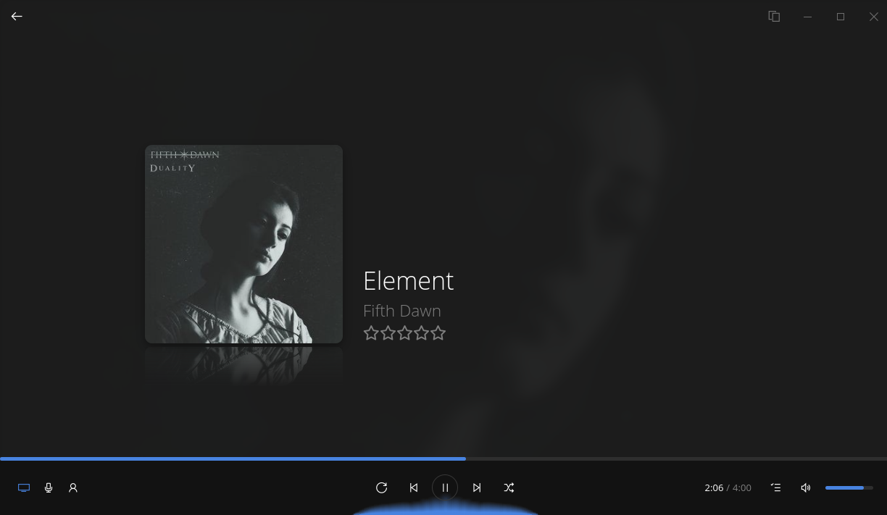
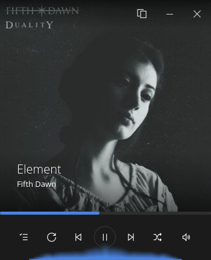
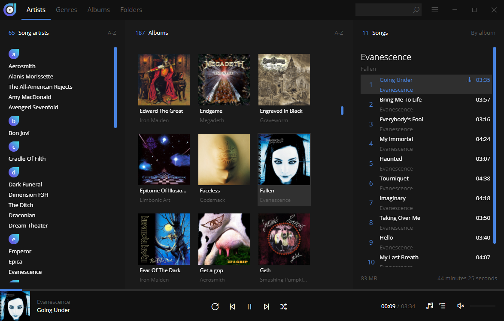
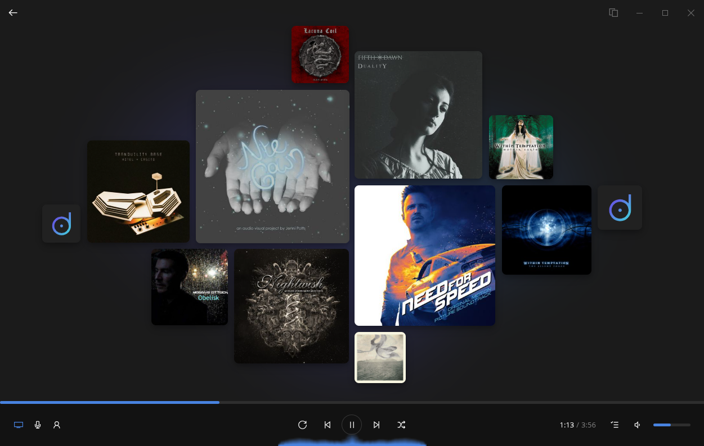

[](https://www.paypal.com/cgi-bin/webscr?cmd=_s-xclick&hosted_button_id=MQALEWTEZ7HX8)


- Open the "dopamine" folder (the folder containing package.json) in your IDE
- Install your IDE of choice (Rider, WebStorm, Visual Studio Code, ...)


**Build prerequisites on MacOS:**
## Pacman


Follow the build instructions below to start or build Dopamine for your platform.



- Install rpm (required to build rpm package): `sudo pacman -S rpm-tools`
Dopamine is available in the AUR as `dopamine-official`. So the installation is as simple as:

### Installation
The pacman package can be installed using this command (replace x.y.z with the correct version number):
- Install Node.js 22

## Debugging
## Build prerequisites


Dopamine icons created by <a href="https://www.itssharl.ee/">Sharlee</a>.
```


snap install --dangerous Dopamine-x.y.z.snap
$ npm install                # Install dependencies
```
You should see:


yay -S dopamine-official
[](https://snapcraft.io/dopamine)
Once you've done that, your Dopamine should be able to access `/media`.
`sudo dnf install Dopamine-x.y.z.rpm`

- Open the "dopamine" folder (the folder containing package.json) in your IDE


I've added the `removable-media` plug to the Dopamine Snap configuration to allow access to `/media`. However, unlike the `home` plug, `removable-media` is not auto-connected by default. After installing your Dopamine snap, verify its connections:
- Download and install Node.js 22 from https://nodejs.org (During the installation, select all features and check the box to install **Tools for Native Modules**).

    - `yay -S nvm`

- Install Node.js 22:
$ npm run electron:linux     # Build for Linux


```
$ npm start                  # Start Dopamine
```
```bash
sudo snap connect dopamine:removable-media
```
```
If you wish to install a manually downloaded snap package, the command is as follows (replace x.y.z with the correct version number):
$ npm run electron:windows   # Build for Windows
If it says `-`, it’s not connected yet. You'll have to connect it manually by running this command:

- Install rpm (required to build rpm package) and libarchive-tools (contains bsdtar, which is required to build pacman package): `sudo apt install rpm libarchive-tools`
Dopamine is available in the Snap store. So the installation is as simple as:

**Build prerequisites on Ubuntu:**


Follow the build instructions below to start or build Dopamine for your platform.
```
## Rpm
- Install your IDE of choice (Rider, WebStorm, Visual Studio Code, ...)

removable-media  dopamine:removable-media  -  -
### Installation
## Snap Store

- Download the Dopamine source code

snap install dopamine
```



    - Press command + space and search for console

    - Write `npm --v` and press enter, this should give you the version number if npm is properly installed.


    - `nvm install 22`


- After the installation of Node.js, restart computer to ensure that npm is added to the path.
**Build prerequisites on Windows:**
- Install your IDE of choice (Rider, WebStorm, Visual Studio Code, ...)


I recommend using JetBrains Rider or WebStorm to debug this project. The **.run** folder contains a debugging configuration **Debug renderer** that allows you to attach to the Dopamine instance that is started when running `npm start`. Most of the code runs in the Electron renderer. That is why only a renderer configuration is provided for now.
```

- Make sure npm is accessible via the console
snap connections dopamine

- rpm: required to build rpm package

If you're getting an error concerning a missing package libappindicator-sharp, use this command to perform the installation instead (replace x.y.z with the correct version number):

- Install your IDE of choice (Rider, WebStorm, Visual Studio Code, ...)

[](https://github.com/digimezzo/dopamine/actions/workflows/nightly.yml)
- Install Node.js 22 from https://nodejs.org (During the installation, select all features and check the box to install Tools for Native Modules).

## Arch User Repository (AUR)
```
### Installation
### Access to /media
**Build prerequisites on Manjaro:**

[](https://github.com/digimezzo/dopamine/issues)
`sudo pacman -U Dopamine-x.y.z.pacman --assume-installed libappindicator-sharp`
$ cd dopamine
```
Follow the build instructions below to start or build Dopamine for your platform.
$ npm run electron:mac       # Build for Mac


$ git clone https://github.com/digimezzo/dopamine.git
- libarchive-tools: contains bsdtar, which is required to build pacman package.
### Installation
> Note: the `dopamine` package in the AUR is not maintained by me. My package is `dopamine-official`.
# Dopamine
- Download the Dopamine source code
```
The rpm package can be installed using this command (replace x.y.z with the correct version number):
```
<a href='https://ko-fi.com/S6S11K63U' target='_blank'></a>
`sudo pacman -U Dopamine-x.y.z.pacman`

[](https://github.com/digimezzo/dopamine/releases/latest)
Due to the native dependency better-sqlite3, this project cannot be built for all platforms on GNU/Linux. The GNU/Linux packages must be built on GNU/Linux, the Windows package must be built on Windows and the MacOS package must be built on MacOS.
## Build instructions
Dopamine is an elegant audio player which tries to make organizing and listening to music as simple and pretty as possible. This version is written using Electron, Angular and Typescript and works on Windows, Linux and Mac.
